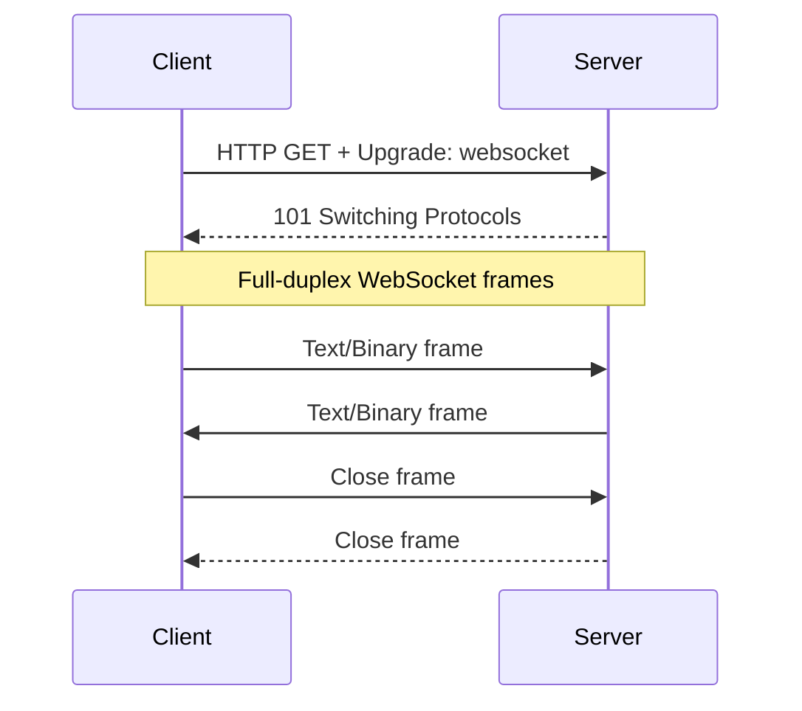

# Level 1 — Beginner: REST Standard & Basic Real-time

ระดับนี้สร้างรากฐาน **Enterprise REST** และ **WebSocket พื้นฐาน** ให้คุณออกแบบ API
ที่ถูกต้องตามมาตรฐาน ก่อนขยายไปสู่ microservices และ scale

---

## สารบัญ

1. [Richardson Maturity Model](#1-richardson-maturity-model)
2. [HTTP Methods และ Semantic Status Codes](#2-http-methods-และ-semantic-status-codes)
3. [API Design Best Practices](#3-api-design-best-practices)
4. [WebSockets Core](#4-websockets-core)
5. [Best Practices สรุป](#5-best-practices-สรุป)
6. [แผนที่ไฟล์ตัวอย่าง](#6-แผนที่ไฟล์ตัวอย่าง)

---

## 1. Richardson Maturity Model

Leonard Richardson แบ่งระดับความ "RESTful" ของ API ออกเป็น 4 ระดับ (0–3) เพื่อวัดว่า API
ใช้ประโยชน์จาก HTTP และ Hypermedia ได้มากน้อยแค่ไหน

### Level 0 — The Swamp of POX

- ใช้ HTTP เป็นแค่ **transport tunnel**
- มักมี endpoint เดียว เช่น `POST /api` แล้วส่ง XML/JSON ที่บอกว่าต้องการทำอะไรใน body
- ไม่ใช้ HTTP methods ตามความหมาย ไม่มี resource URI ที่ชัดเจน

```http
POST /api HTTP/1.1
Content-Type: application/json

{ "action": "getOrder", "orderId": "123" }
```

**ปัญหา:** cache ไม่ได้, ไม่มี idempotency ตาม method, tooling ของ HTTP (monitoring, CDN, security)
ใช้ประโยชน์ได้น้อย

### Level 1 — Resources

- แยก **resources** ด้วย URI ที่แตกต่างกัน
- แต่ยังใช้ method เดียว (มักเป็น POST) สำหรับทุกการกระทำ

```http
POST /orders/123
{ "action": "cancel" }

POST /orders/123
{ "action": "get" }
```

**ดีขึ้น:** มี resource identity แต่ยังไม่ใช้ HTTP semantics

### Level 2 — HTTP Verbs (เป้าหมายขั้นต่ำของ Enterprise REST)

- ใช้ **HTTP methods** ตามความหมาย (GET/POST/PUT/PATCH/DELETE)
- ใช้ **status codes** ตามความหมาย (200, 201, 204, 400, 404, 409, 422, …)
- ส่วนใหญ่ของ public REST APIs ในองค์กรอยู่ที่ระดับนี้

```http
GET /orders/123  → 200 + body
POST /orders  → 201 + Location header
PUT /orders/123  → 200/204 (replace ทั้ง resource)
PATCH /orders/123  → 200 (partial update)
DELETE /orders/123  → 204
```

### Level 3 — HATEOAS (Hypermedia As The Engine Of Application State)

- Response ไม่ได้มีแค่ข้อมูล แต่มี **links** ที่บอกว่า client ทำอะไรต่อได้บ้าง
- Client ค้นพบ API ผ่าน hypermedia ไม่ hard-code path ทั้งหมด

```json
{
  "id": "123",
  "status": "pending",
  "_links": {
    "self": { "href": "/orders/123" },
    "cancel": { "href": "/orders/123/cancel", "method": "POST" },
    "pay": { "href": "/orders/123/payments", "method": "POST" }
  }
}
```

**ข้อดี:** ลด coupling ระหว่าง client กับ server path **ข้อควรรู้:** ต้นทุน implementation สูงกว่า —
ใช้เมื่อมี client หลากหลายและ lifecycle ของ resource ซับซ้อน

| Level | ใช้เมื่อ                            | ข้อควรระวัง                                |
| ----- | ----------------------------------- | ------------------------------------------ |
| 0     | Legacy / RPC over HTTP              | หลีกเลี่ยงสำหรับ API ใหม่                  |
| 1     | Migration ชั่วคราว                  | อย่าหยุดที่นี่                             |
| 2     | **Default ของ Enterprise REST**     | ต้องมี status codes ที่ถูกต้อง             |
| 3     | Public platform / complex workflows | อย่า over-engineer ถ้า client เป็นทีมเดียว |

---

## 2. HTTP Methods และ Semantic Status Codes

### ความหมายของ Methods

| Method | ความหมาย                           | Idempotent?    | Safe? | ใช้เมื่อ                   |
| ------ | ---------------------------------- | -------------- | ----- | -------------------------- |
| GET    | อ่าน resource                      | ใช่            | ใช่   | list / detail              |
| POST   | สร้าง resource หรือ trigger action | ไม่            | ไม่   | create, non-idempotent ops |
| PUT    | แทนที่ resource ทั้งก้อน           | ใช่            | ไม่   | full replace               |
| PATCH  | แก้บางฟิลด์                        | ขึ้นกับ design | ไม่   | partial update             |
| DELETE | ลบ resource                        | ใช่            | ไม่   | soft/hard delete           |

**Idempotent** = เรียกซ้ำได้ผลลัพธ์เดียวกัน (สำคัญสำหรับ retry) **Safe** = ไม่เปลี่ยน state ของ
server

### Status Codes ที่ควรใช้ใน Enterprise

| Code                     | ความหมาย                            | ตัวอย่าง                   |
| ------------------------ | ----------------------------------- | -------------------------- |
| 200 OK                   | สำเร็จพร้อม body                    | GET, PATCH                 |
| 201 Created              | สร้างสำเร็จ                         | POST → ส่ง `Location`      |
| 204 No Content           | สำเร็จไม่มี body                    | DELETE, PUT                |
| 400 Bad Request          | request ผิดรูปแบบ                   | JSON ผิด                   |
| 401 Unauthorized         | ยังไม่ authenticate                 | ไม่มี token                |
| 403 Forbidden            | authenticate แล้วแต่ไม่มีสิทธิ์     | role ไม่พอ                 |
| 404 Not Found            | ไม่พบ resource                      | id ผิด                     |
| 409 Conflict             | ขัดกับ state ปัจจุบัน               | duplicate, optimistic lock |
| 422 Unprocessable Entity | syntax ถูกแต่ business rule ไม่ผ่าน | stock ไม่พอ                |
| 429 Too Many Requests    | rate limit                          | เกินโควต้า                 |
| 500 / 503                | server error / unavailable          | อย่า leak stack trace      |

### Error Body มาตรฐาน (แนะนำ)

```json
{
  "type": "https://api.example.com/errors/validation",
  "title": "Validation Failed",
  "status": 422,
  "detail": "quantity must be >= 1",
  "instance": "/orders",
  "errors": [{ "field": "quantity", "code": "MIN_VALUE", "message": "must be >= 1" }]
}
```

อ้างอิงแนวคิดจาก [RFC 9457 Problem Details](https://www.rfc-editor.org/rfc/rfc9457)

---

## 3. API Design Best Practices

### 3.1 โครงสร้าง URI

**หลักการ:**

- ใช้ **nouns (พหูพจน์)** ไม่ใช่ verbs: `/orders` ไม่ใช่ `/getOrders`
- Nest ตามความสัมพันธ์จริง: `/orders/123/items`
- หลีกเลี่ยงความลึกเกิน 2–3 ระดับ
- ใช้ kebab-case หรือ lowercase สม่ำเสมอ: `/order-items`
- Resource ID อยู่ใน path; filter อยู่ใน query

```
✅ GET /users/42/orders?status=paid&page=1
❌ GET /getUserOrders?userId=42&do=paid
❌ POST /users/doSomething
```

### 3.2 Query Parameters: Filtering, Sorting, Pagination

#### Filtering

```http
GET /products?category=electronics&minPrice=100&maxPrice=500&inStock=true
```

- ชื่อ parameter ควรตรงกับ field ของ resource
- สำหรับ filter ซับซ้อน อาจใช้ `filter[status]=active` หรือ RSQL (`status==active;price=gt=100`)

#### Sorting

```http
GET /products?sort=price  # ascending
GET /products?sort=-createdAt # descending (prefix -)
GET /products?sort=-createdAt,name # multi-field
```

#### Pagination

**Offset-based** (ง่าย, เหมาะกับ admin UI):

```http
GET /orders?page=2&limit=20
```

Response:

```json
{
 "data": [ ... ],
 "meta": {
 "page": 2,
 "limit": 20,
 "total": 350,
 "totalPages": 18
 },
 "links": {
 "self": "/orders?page=2&limit=20",
 "next": "/orders?page=3&limit=20",
 "prev": "/orders?page=1&limit=20"
 }
}
```

**Cursor-based** (เหมาะกับ feed / real-time / ข้อมูลเปลี่ยนบ่อย):

```http
GET /orders?limit=20&cursor=eyJpZCI6MTAwfQ
```

ข้อดีของ cursor: ไม่ skip/duplicate เมื่อมี insert ระหว่างหน้าที่กำลังเลื่อน

### 3.3 Content Negotiation และ Headers สำคัญ

| Header                   | บทบาท                         |
| ------------------------ | ----------------------------- |
| `Accept`                 | client ขอ media type          |
| `Content-Type`           | ประเภท body ที่ส่ง            |
| `ETag` / `If-None-Match` | conditional GET / cache       |
| `Idempotency-Key`        | ทำให้ POST ปลอดภัยเมื่อ retry |
| `X-Request-Id`           | tracing ข้าม services         |

---

## 4. WebSockets Core

### 4.1 ทำไมต้อง WebSocket?

| แนวทาง                   | ทิศทาง                | Overhead          | เหมาะกับ               |
| ------------------------ | --------------------- | ----------------- | ---------------------- |
| Short Polling            | Client → Server ซ้ำ ๆ | สูงมาก            | ไม่แนะนำ               |
| Long Polling             | Client ค้าง request   | ปานกลาง           | fallback               |
| Server-Sent Events (SSE) | Server → Client       | ต่ำ               | one-way push           |
| **WebSocket**            | **Full-Duplex**       | ต่ำหลัง handshake | chat, live ops, collab |

**Full-Duplex** = client และ server ส่งข้อมูลได้พร้อมกันบน connection เดียว โดยไม่ต้องเปิด HTTP
request ใหม่ทุกครั้ง

### 4.2 HTTP Upgrade Handshake

WebSocket เริ่มจาก HTTP request พิเศษ แล้ว "อัปเกรด" เป็น WS protocol:

```http
GET /ws HTTP/1.1
Host: api.example.com
Upgrade: websocket
Connection: Upgrade
Sec-WebSocket-Key: dGhlIHNhbXBsZSBub25jZQ==
Sec-WebSocket-Version: 13
```

Server ตอบ:

```http
HTTP/1.1 101 Switching Protocols
Upgrade: websocket
Connection: Upgrade
Sec-WebSocket-Accept: s3pPLMBiTxaQ9kYGzzhZRbK+xOo=
```

หลังจากนั้นจะเป็น **frame-based binary protocol** (ไม่ใช่ HTTP อีกต่อไป)



### 4.3 เปรียบเทียบกับ Traditional Polling

```
Polling (ทุก 2 วินาที):
 t=0 GET /status → 200 {same}
 t=2 GET /status → 200 {same}
 t=4 GET /status → 200 {changed!} ← latency สูง + เปลือง bandwidth

WebSocket:
 t=0 connect
 t=4 server push {changed!}  ← ทันทีเมื่อมี event
```

### 4.4 โครงสร้างข้อความพื้นฐาน

แนะนำให้กำหนด **message envelope** ตั้งแต่แรก:

```json
{
  "type": "order.updated",
  "id": "msg-uuid",
  "timestamp": "2026-07-18T16:00:00Z",
  "payload": {
    "orderId": "123",
    "status": "shipped"
  }
}
```

เหตุผล: ง่ายต่อการ version, route, และ debug เมื่อระบบโต

---

## 5. Best Practices สรุป

### REST

1. เป้าหมายขั้นต่ำคือ **Richardson Level 2** — Level 3 เมื่อมีเหตุผลชัด
2. ใช้ status codes ตามความหมาย — อย่าคืน 200 แล้วใส่ `"error": true` ใน body
3. Pagination ทุก list endpoint — กำหนด `limit` สูงสุด (เช่น 100)
4. ใส่ `Idempotency-Key` สำหรับ POST ที่สำคัญ (payment, order)
5. Error format เป็นมาตรฐานเดียวทั้งระบบ (Problem Details)
6. Document ด้วย OpenAPI 3.x

### WebSocket

1. Validate origin / token **ตอน handshake** ไม่ใช่หลังเชื่อมแล้วค่อยคิด
2. กำหนด message schema และ reject message ที่ไม่รู้จัก type
3. จำกัดขนาด frame และ rate ของข้อความต่อ connection
4. มีแผน **fallback** (SSE หรือ long-polling) สำหรับ network ที่บล็อก WS
5. Log connection open/close พร้อม reason code

---

## 6. แผนที่ไฟล์ตัวอย่าง

```
01-beginner/
├── README.md    ← คุณอยู่ที่นี่
├── LAB.md    ← โจทย์ + เฉลย
└── src/
 ├── rest/
 │ ├── typescript/server.ts ← RMM L2–L3 + filter/sort/page
 │ ├── go/main.go
 │ └── python/server.py
 └── websocket/
 ├── typescript/server.ts + client.ts
 ├── go/main.go + client.go
 └── python/server.py + client.py
```

### วิธีรันตัวอย่าง

```bash
# REST — TypeScript
cd src/rest/typescript && npm install && npx tsx server.ts

# REST — Go
cd src/rest/go && go run .

# REST — Python
cd src/rest/python && pip install -r requirements.txt && python server.py

# WebSocket — TypeScript
cd src/websocket/typescript && npm install && npx tsx server.ts
# terminal อีกอัน
npx tsx client.ts
```

---

**ถัดไป:** ทำ [`LAB.md`](./LAB.md) ให้จบ แล้วไป [`../02-intermediate/`](../02-intermediate/)
