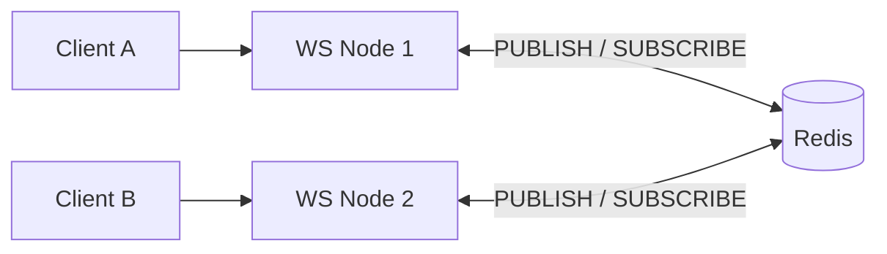
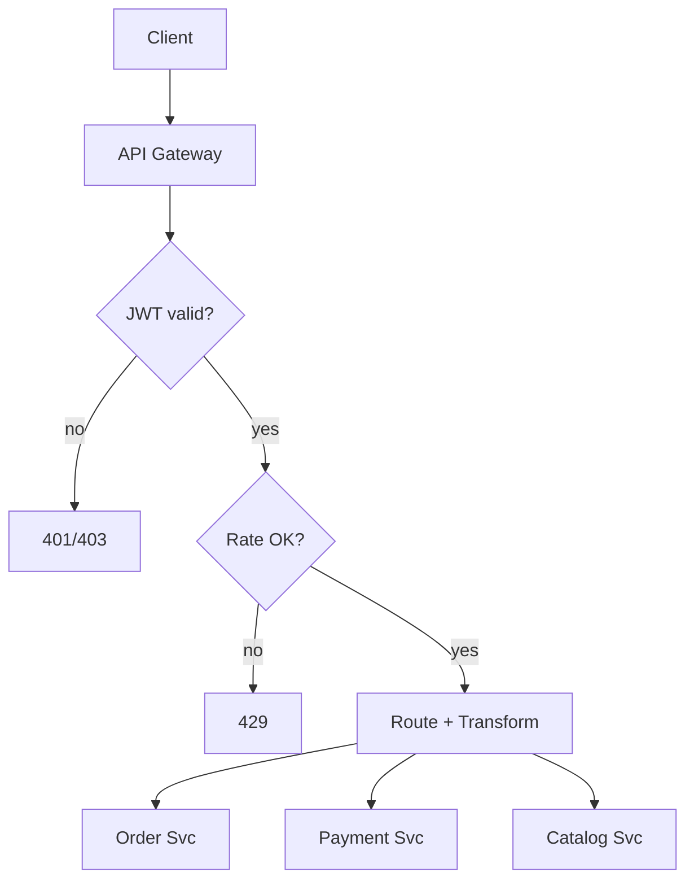

# Level 2 — Intermediate: Stateful Connections & Microservices Foundations

ระดับนี้ยกระดับจาก WebSocket พื้นฐานไปสู่ **การจัดการ connection ที่เชื่อถือได้**, **scale แนวนอน**,
และ **API Gateway** ซึ่งเป็นหัวใจของ microservices ในองค์กร

---

## สารบัญ

1. [Advanced WebSockets](#1-advanced-websockets)
2. [Microservices API Design](#2-microservices-api-design)
3. [API Gateway](#3-api-gateway)
4. [Payload Optimization, Versioning & CORS](#4-payload-optimization-versioning--cors)
5. [Best Practices สรุป](#5-best-practices-สรุป)
6. [แผนที่ไฟล์ตัวอย่าง](#6-แผนที่ไฟล์ตัวอย่าง)

---

## 1. Advanced WebSockets

### 1.1 Connection Lifecycle

```
CONNECTING → OPEN → CLOSING → CLOSED
  ↑
  (อาจมี half-open / zombie)
```

สถานะที่อันตรายที่สุดคือ **half-open**: TCP ดูเหมือนยังเปิดอยู่ แต่ peer หายไปแล้ว (Wi-Fi หลุด,
laptop sleep, NAT timeout) — server ยังถือ connection ไว้กิน file descriptor และ memory

**Lifecycle hooks ที่ควรมี:**

| Event              | ทำอะไร                                               |
| ------------------ | ---------------------------------------------------- |
| `connection`       | authenticate, ลงทะเบียนใน hub, ส่ง snapshot เริ่มต้น |
| `message`          | validate schema, rate-limit, route ตาม `type`        |
| `pong` / heartbeat | update `lastSeen`                                    |
| `close`            | ถอดจาก rooms, cleanup timers, metrics                |
| `error`            | log + ปิดอย่างสุภาพ                                  |

### 1.2 Heartbeats / Ping-Pong — ตรวจจับ Dead Clients

WebSocket มี **control frames** `ping` / `pong` ในระดับ protocol (ไม่ใช่ application JSON)

กลยุทธ์มาตรฐาน:

1. Server ส่ง `ping` ทุก `N` วินาที (เช่น 30s)
2. ถ้าไม่ได้รับ `pong` ภายใน `N + grace` → **terminate** connection
3. Client ฝั่งแอปอาจส่ง application-level `{type:"ping"}` เพิ่มเติมผ่าน proxy ที่กลืน protocol ping

```typescript
// Pseudo-pattern
ws.isAlive = true;
ws.on('pong', () => {
  ws.isAlive = true;
});

setInterval(() => {
  for (const client of wss.clients) {
    if (!client.isAlive) {
      client.terminate();
      continue;
    }
    client.isAlive = false;
    client.ping();
  }
}, 30_000);
```

**ทำไมสำคัญใน production:** ถ้าไม่ทำ heartbeat cluster จะเต็มไปด้วย zombie connections → memory
leak + ข้อความส่งไม่ถึงจริง

### 1.3 Room-based Broadcasting

แทนที่จะ broadcast หาทุกคน ให้จัดกลุ่ม:

```
room:order:123 → ผู้ติดตามออเดอร์นั้น
room:user:42 → notification ส่วนตัว
room:ops:alerts → ทีม operations
```

```
join(room) → rooms.get(room).add(socket)
leave(room) → rooms.get(room).delete(socket)
to(room) → ส่งเฉพาะสมาชิกใน room
```

ข้อดี: ลด bandwidth, แยกสิทธิ์ได้, ง่ายต่อ audit

### 1.4 Horizontal Scaling ด้วย Redis Adapter (Pub/Sub)

ปัญหา: WebSocket เป็น **stateful** — connection ผูกกับ process หนึ่งตัว

```
Client A ──► WS Node 1
Client B ──► WS Node 2

ถ้า Node 1 broadcast ภายใน process → Client B ไม่ได้ยิน!
```

**ทางแก้:** ใช้ Redis Pub/Sub เป็น bus ระหว่าง nodes



ลำดับเหตุการณ์:

1. Client A ส่งข้อความที่ Node 1
2. Node 1 ส่งให้ local clients ใน room
3. Node 1 `PUBLISH room:chat channel payload`
4. Node 2 ได้รับจาก Redis แล้วส่งให้ local clients ใน room เดียวกัน
5. **อย่า** ให้ Node ที่ publish ประมวลผล message จาก Redis ซ้ำ (ใช้ `instanceId` กรอง)

**ทางเลือกอื่น:** sticky sessions ที่ LB (ง่ายแต่ failover แย่), หรือ message broker (NATS/Kafka)
สำหรับ fan-out ขนาดใหญ่

---

## 2. Microservices API Design

### 2.1 Internal APIs vs External APIs

| มิติ       | External (Public / Partner)   | Internal (Service-to-Service)          |
| ---------- | ----------------------------- | -------------------------------------- |
| ผู้ใช้     | แอปมือถือ, partner, 3rd party | services ใน cluster                    |
| Contract   | เสถียร, versioned, documented | เปลี่ยนได้เร็วกว่า (ยังควรมี contract) |
| Auth       | OAuth2 / API keys             | mTLS, service mesh identity            |
| Payload    | ละเอียดน้อย, ซ่อน internals   | อาจรวม fields สำหรับ ops               |
| Rate limit | เข้มงวดต่อ client             | เน้น bulkheads / timeouts              |
| Protocol   | REST / GraphQL เป็นหลัก       | REST, gRPC, events                     |

**กฎทอง:** อย่าให้ external client เรียก internal service โดยตรง — ผ่าน **API Gateway** เสมอ

### 2.2 Inter-service Communication Patterns

| Pattern                  | เมื่อใช้                     | ข้อควรระวัง          |
| ------------------------ | ---------------------------- | -------------------- |
| Sync HTTP/gRPC           | ต้องการคำตอบทันที            | cascading failure    |
| Async Messaging          | fire-and-forget / eventual   | eventual consistency |
| Request/Reply ผ่าน queue | ต้องการ async แต่มี response | correlation id       |
| CDC / Domain Events      | แจ้งการเปลี่ยนแปลงข้อมูล     | schema evolution     |

---

## 3. API Gateway

API Gateway คือ **edge reverse proxy** ที่รวม cross-cutting concerns

### หน้าที่หลัก

1. **Reverse Proxy / Routing** — `/orders/*` → Order Service
2. **Authentication / Authorization** — ตรวจ JWT ที่ขอบ
3. **Rate Limiting** — ปกป้อง backend จาก abuse
4. **Request/Response Transformation** — เปลี่ยน header, path, strip internal fields
5. **TLS termination** — จัดการ certificate ที่ขอบ
6. **Observability** — request id, metrics, access logs



### Rate Limiting Algorithms (สั้น ๆ)

| Algorithm      | จุดเด่น                | จุดอ่อน              |
| -------------- | ---------------------- | -------------------- |
| Fixed Window   | ง่าย                   | burst ที่ขอบหน้าต่าง |
| Sliding Window | นุ่มกว่า               | ซับซ้อนกว่า          |
| Token Bucket   | อนุญาต burst ควบคุมได้ | ต้อง tune            |
| Leaky Bucket   | ทำให้ traffic เรียบ    | latency เพิ่มได้     |

ในตัวอย่าง bootcamp ใช้ **Token Bucket ต่อ API key / IP** ใน memory (production ใช้ Redis)

### Request Transformation ตัวอย่าง

```
Client → Gateway:
 GET /v1/orders/123
 Authorization: Bearer ...

Gateway → Order Service:
 GET /internal/orders/123
 X-User-Id: 42
 X-Request-Id: ...
 (ไม่มี Authorization ดิบ — map เป็น identity headers)
```

---

## 4. Payload Optimization, Versioning & CORS

### 4.1 Complex JSON Payloads

- ใช้ **sparse fieldsets**: `?fields=id,status,total`
- หลีกเลี่ยง over-fetch: อย่าฝังทั้ง user graph ในทุก order
- จำกัดความลึกของ nesting; ใช้ link / id อ้างอิงแทน
- Compress ด้วย gzip/br ที่ gateway
- สำหรับ payload ใหญ่ (upload) ใช้ **presigned URL** ไม่ส่งไฟล์ผ่าน JSON

### 4.2 Versioning Strategies

| กลยุทธ์        | ตัวอย่าง                               | ข้อดี              | ข้อเสีย                       |
| -------------- | -------------------------------------- | ------------------ | ----------------------------- |
| **URL**        | `/v1/orders`                           | ชัด, ง่ายต่อ cache | URL เปลี่ยนเมื่อ version ใหม่ |
| **Header**     | `Accept-Version: 1`                    | URI สะอาด          | ยาก debug จาก browser         |
| **Media Type** | `Accept: application/vnd.shop.v1+json` | ตาม HTTP เต็มที่   | tooling น้อยกว่า              |

**คำแนะนำ Enterprise:** เริ่มด้วย URL versioning สำหรับ public API — ง่ายต่อการสื่อสารกับ partner
รองรับ deprecation header: `Deprecation: true` + `Sunset: <date>`

### 4.3 CORS อย่างปลอดภัย

CORS เป็นกลไกของ **browser** ไม่ใช่ security layer หลักของ API

**ตั้งค่าที่ปลอดภัย:**

```
Access-Control-Allow-Origin: https://app.example.com ← ระบุ origin ชัด ไม่ใช้ * เมื่อมี credentials
Access-Control-Allow-Credentials: true
Access-Control-Allow-Methods: GET, POST, PATCH, DELETE
Access-Control-Allow-Headers: Authorization, Content-Type, Idempotency-Key
Access-Control-Max-Age: 600
```

**อย่าทำ:**

- `Allow-Origin: *` คู่กับ `Allow-Credentials: true` (ผิด spec / อันตราย)
- สะท้อน `Origin` กลับโดยไม่ whitelist
- เปิด methods/headers กว้างเกินจำเป็น

Preflight (`OPTIONS`) ควรถูกจัดการที่ Gateway เพื่อลดโหลดถึง services

---

## 5. Best Practices สรุป

1. Heartbeat ทุก WebSocket server ใน production — ไม่มีข้อยกเว้น
2. ออกแบบ room ตาม **authorization boundary** ไม่ใช่แค่ convenience
3. Scale WS ด้วย pub/sub adapter + sticky session เป็นทางเลือกไม่ใช่ทางเดียว
4. External ≠ Internal contract — Gateway เป็นขอบเขตความรับผิดชอบ
5. Rate limit ที่ขอบ + timeout/bulkhead ที่ service
6. Version public APIs ตั้งแต่วันแรก มีแผน deprecate
7. CORS whitelist origins; auth จริงทำที่ token/session ไม่พึ่ง CORS

---

## 6. แผนที่ไฟล์ตัวอย่าง

```
02-intermediate/
├── README.md
├── LAB.md
└── src/
 ├── websocket/
 │ ├── typescript/ ← heartbeat + rooms + Redis adapter
 │ └── go/  ← heartbeat + rooms
 ├── gateway/
 │ ├── typescript/ ← reverse proxy + rate limit + transform
 │ ├── go/
 │ └── python/
 └── security/
 └── cors-versioning.ts
```

### วิธีรัน

```bash
# Redis สำหรับ adapter
docker run -d --name bootcamp-redis -p 6379:6379 redis:7-alpine

# WS hub
cd src/websocket/typescript && npm install && npx tsx server.ts

# Gateway
cd src/gateway/typescript && npm install && npx tsx gateway.ts
```

---

**ถัดไป:** ทำ [`LAB.md`](./LAB.md) แล้วไป [`../03-expert/`](../03-expert/)
