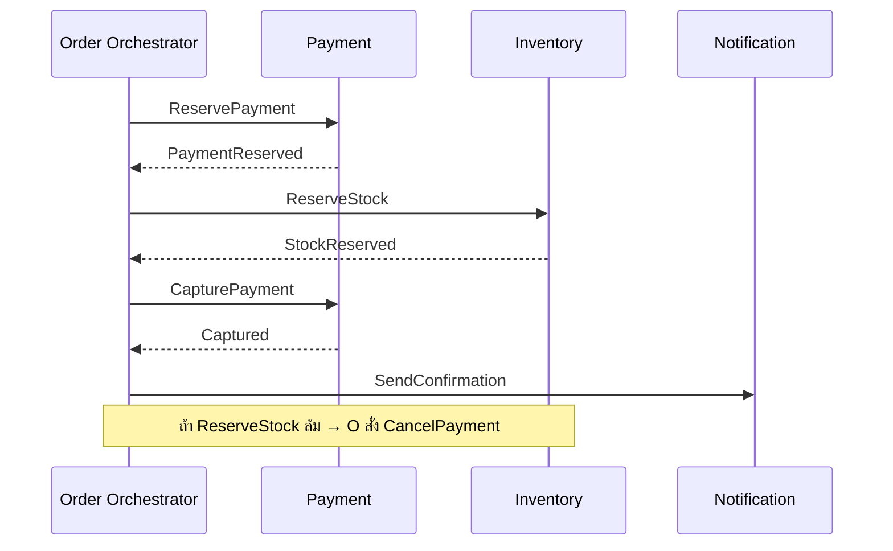

# Level 3 — Expert: Enterprise Orchestration, Resilience & Real-time at Scale

ระดับนี้รวม **ความสอดคล้องของข้อมูลข้าม services**, **WebSocket ระดับพัน/หมื่น connection**, และ
**security + zero-downtime** ที่ใช้จริงในระบบองค์กรขนาดใหญ่

---

## สารบัญ

1. [Microservices Data & Coordination](#1-microservices-data--coordination)
2. [High-Performance WebSockets](#2-high-performance-websockets)
3. [Security Hardening & Zero-Downtime](#3-security-hardening--zero-downtime)
4. [Best Practices สรุป](#4-best-practices-สรุป)
5. [แผนที่ไฟล์ตัวอย่าง](#5-แผนที่ไฟล์ตัวอย่าง)

---

## 1. Microservices Data & Coordination

### 1.1 ทำไม 2PC จึงไม่พอใน Microservices

Two-Phase Commit (2PC) ต้องการ lock ข้ามระบบ และ coordinator ที่พร้อมทุกฝ่าย — ในระบบที่ services มี
autonomy, latency, และ failure domains คนละแบบ จะกลายเป็น **availability killer**

องค์กรส่วนใหญ่เลือก **Eventual Consistency** พร้อม **compensating transactions**

### 1.2 Saga Pattern

Saga = ลำดับ local transactions โดยแต่ละขั้นมี **compensating action** ถ้าขั้นถัดไปล้ม

#### Choreography

- แต่ละ service ฟัง event แล้วทำต่อ
- ไม่มี central orchestrator
- ข้อดี: loose coupling
- ข้อเสีย: ยาก debug เมื่อ flow ซับซ้อน (event spaghetti)

```
OrderCreated → PaymentService หักเงิน → PaymentCompleted
  → InventoryService จองของ → InventoryReserved
ถ้า PaymentFailed → InventoryService ปล่อยของ (compensate)
```

#### Orchestration

- มี **Orchestrator** สั่งแต่ละขั้นชัดเจน
- ข้อดี: มอง flow เป็นที่เดียว, timeout/retry ชัด
- ข้อเสีย: orchestrator อาจเป็นจุดรวม logic



### 1.3 Eventual Consistency

ยอมรับว่ามีช่วงเวลาที่ข้อมูลคนละ service **ไม่ตรงกันชั่วคราว** แต่ระบบจะ converge

เทคนิคประกอบ:

- **Idempotent consumers** (dedupe ด้วย event id)
- **Outbox pattern** — เขียน DB + outbox ใน transaction เดียวกัน แล้ว publisher อ่าน outbox
- **Inbox pattern** — กันประมวลผลซ้ำฝั่งผู้รับ
- **Version / vector clocks** สำหรับ conflict ที่ซับซ้อน

### 1.4 Change Data Capture (CDC)

CDC จับการเปลี่ยนแปลงจาก transaction log ของ DB (เช่น Debezium + Postgres WAL) แล้ว publish เป็น
events

**ประโยชน์:**

- services อื่นไม่ต้องถูกเรียก sync จากเจ้าของข้อมูล
- ลด coupling แบบ “จำต้องเรียก API ทุกครั้งที่ข้อมูลเปลี่ยน”
- รองรับ search index, cache invalidation, audit, real-time feed

```
Orders DB ──WAL──► Debezium ──► Kafka topic order.events ──► WS Notifier / Search / Analytics
```

ข้อควรระวัง: schema evolution, ordering ต่อ partition key, และ **ห้าม** ส่ง PII ดิบโดยไม่ผ่าน policy

---

## 2. High-Performance WebSockets

### 2.1 Bottlenecks ที่พบบ่อย

| Bottleneck                   | สาเหตุ                       | แนวทาง                                       |
| ---------------------------- | ---------------------------- | -------------------------------------------- |
| File descriptors             | default `ulimit -n` ต่ำ      | เพิ่ม soft/hard limit, systemd `LimitNOFILE` |
| Memory ต่อ conn              | buffer ใหญ่เกิน, room index  | ลด buffer, ใช้ connection metadata บาง ๆ     |
| Single-thread event loop     | CPU-heavy ใน message handler | ย้ายงานหนักออกจาก hot path                   |
| Head-of-line / slow consumer | client อ่านช้า               | backpressure, drop, หรือ disconnect          |
| GC pressure                  | alloc ต่อ message สูง        | reuse buffer, binary protocol, pooling       |
| Cross-node fan-out           | Redis เป็น hotspot           | shard channel, NATS, หรือ sticky+locality    |

### 2.2 File Descriptor Limits

แต่ละ WebSocket ≈ อย่างน้อย 1 FD (และอาจมากกว่าถ้ามี upstream)

```bash
ulimit -n       # ดูค่าปัจจุบัน
ulimit -n 65535 # session (demo)
# production: ตั้งใน systemd / container
# LimitNOFILE=1048576
```

อย่าลืม: load balancer, Redis connections, และ outbound HTTP ก็กิน FD เช่นกัน

### 2.3 Backpressure

เมื่อ producer เร็วกว่า consumer:

1. **Buffer มีขอบเขต** (bounded queue ต่อ connection)
2. เมื่อเต็ม → **drop** (lossy metrics) หรือ **disconnect** (strict realtime) หรือ **slow down
   publisher**
3. ใช้ TCP window โดยไม่ซ่อนด้วย unbounded in-memory queue

```typescript
// แนวคิด: ถ้า bufferedAmount สูงเกิน threshold ให้ skip / kick
if (ws.bufferedAmount > 1_000_000) {
  ws.close(1008, 'backpressure');
}
```

### 2.4 Reconnection ด้วย Exponential Backoff

Client ต้องสมมติว่า connection **จะหลุด** — และ reconnect อย่างฉลาด

```
delay = min(cap, base * 2^attempt) + jitter
attempt: 0 → 1s, 1 → 2s, 2 → 4s, ... cap 30s
jitter: ป้องกัน thundering herd ตอน server กลับมา
```

เพิ่มเติม:

- Resume ด้วย `lastEventId` / cursor ถ้าต้องการ at-least-once delivery ของ events
- Fallback: SSE หรือ long-poll เมื่อ WS ถูกบล็อก
- Distinguish **auth failure** (อย่า retry ถี่) กับ **network blip**

---

## 3. Security Hardening & Zero-Downtime

### 3.1 OAuth2 / JWT ที่ API Gateway

**แนะนำ:** ตรวจสอบ JWT ที่ **Gateway** (หรือ service mesh authz) แล้วส่ง identity ลงภายใน

Claims ที่ควรตรวจ:

- `iss`, `aud`, `exp`, `nbf`
- signature ด้วย JWKS (หมุน key ได้)
- scope / roles สำหรับ authorization

Stateful vs Stateless:

|         | Stateless JWT             | Stateful token / introspection |
| ------- | ------------------------- | ------------------------------ |
| ข้อดี   | เร็ว ไม่ต้องเรียก store   | เพิกถอนได้ทันที                |
| ข้อเสีย | revoke ยากจนกว่าจะหมดอายุ | latency / dependency เพิ่ม     |

รูปแบบผสมที่ใช้บ่อย: JWT อายุสั้น + refresh token แบบ revoke ได้ + denylist สำหรับ emergency revoke

### 3.2 Mutual TLS (mTLS) สำหรับ Internal Traffic

mTLS = ทั้ง client และ server แสดง certificate

```
External TLS (client ↔ gateway) ≠ Internal mTLS (gateway ↔ services ↔ services)
```

ประโยชน์: กัน spoof identity ภายใน cluster, เข้ารหัส east-west traffic มักทำผ่าน service mesh
(Istio/Linkerd) หรือ sidecar / library

### 3.3 Circuit Breaker — ตัดพึ่งพาเมื่อปลายทางพัง

```
Closed ──(failures ≥ threshold)──► Open ──(after cooldown)──► Half-Open ──(probe OK)──► Closed
     │
     └── fail fast ทันที ไม่ยิงต่อไปยัง dependency
```

ใช้คู่กับ: timeouts, retries แบบมีงบ (budget), bulkheads (จำกัด concurrency ต่อ dependency)

### 3.4 Blue-Green และ Canary สำหรับ API

| กลยุทธ์    | แนวคิด                              | เหมาะกับ             |
| ---------- | ----------------------------------- | -------------------- |
| Blue-Green | สองสภาพแวดล้อม สลับ traffic ทีเดียว | rollback เร็ว        |
| Canary     | ปล่อย % น้อยแล้วขยาย                | ตรวจ regression จริง |

**ออกแบบ API ให้รองรับ zero-downtime:**

1. **Backward-compatible changes ก่อน** (เพิ่ม field ได้, อย่าลบ/เปลี่ยนความหมายทันที)
2. Expand/Contract: เขียนทั้งของเก่าและใหม่ → migrate → ลบของเก่า
3. Connection draining สำหรับ WebSocket: หยุดรับ conn ใหม่ → รอ close / idle timeout → ปิด process
4. Gateway ชี้ canary ตาม header `X-Canary: 1` หรือ % hash ของ user id
5. Database migration แยกจาก app deploy (expand schema ก่อน)

---

## 4. Best Practices สรุป

1. Distributed transaction → Saga + idempotency ไม่ใช่ 2PC ข้ามทีม
2. CDC เป็นเครื่องมือ coupling แบบหลวม — ไม่ใช่แทน domain events ทั้งหมดเสมอไป
3. วัด FD, RSS/connection, message lag, drop rate ของ WS อย่างจริงจัง
4. Backpressure เป็น feature ไม่ใช่ edge case
5. Auth ที่ขอบ + mTLS ภายใน + least privilege
6. Circuit breaker ทุก sync dependency ที่สำคัญ
7. Deploy แบบ compatible-first; drain WS ก่อนฆ่า pod

---

## 5. แผนที่ไฟล์ตัวอย่าง

```
03-expert/
├── README.md
├── LAB.md
└── src/
 ├── saga/
 │ ├── typescript/orchestrator.ts
 │ └── go/saga.go
 ├── websocket-scale/
 │ ├── typescript/server.ts + client-reconnect.ts
 │ └── go/server.go
 ├── security/
 │ ├── typescript/gateway-jwt.ts
 │ └── go/mtls-notes.md + example dial
 └── resilience/
 └── circuit-breaker.ts
```

---

**ถัดไป:** ทำ [`LAB.md`](./LAB.md) — นี่คือบททดสอบรวมก่อนจบ bootcamp
