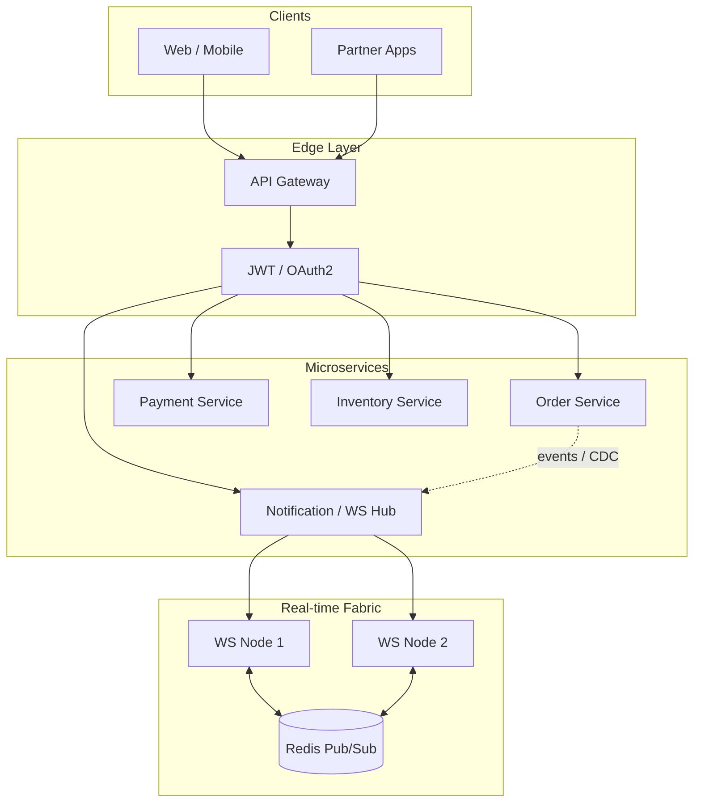

# API & Real-time Communication Bootcamp — Zero to Expert

bootcamp เรียนรู้ **Enterprise RESTful APIs, WebSockets และ Microservices Architecture** แบบครบวงจร
จาก REST Standard / Basic Real-time → Stateful Connections / Gateway → Enterprise Orchestration /
Resilience / Scale

---

## เป้าหมายของหลักสูตร

เมื่อจบหลักสูตรนี้ คุณจะสามารถ:

- ออกแบบ **True RESTful APIs** ตาม Richardson Maturity Model (Level 0–3 HATEOAS) พร้อม HTTP Methods
  และ Status Codes ที่ถูกต้อง
- จัดการ **URI Design, Filtering, Sorting, Pagination** ตามมาตรฐานอุตสาหกรรม
- สร้าง **WebSocket Server/Client** เข้าใจ HTTP Upgrade, Full-Duplex, Heartbeats, Rooms และ Redis
  Adapter
- ออกแบบ **API Gateway** (Reverse Proxy, Rate Limiting, Request Transformation) และแยก Internal vs
  External APIs
- ใช้ **Saga Pattern, Eventual Consistency, CDC** สำหรับ Distributed Transactions
- Hardening ด้วย **OAuth2/JWT, mTLS, Circuit Breakers** และออกแบบ Zero-Downtime (Blue-Green /
  Canary)

---

## โครงสร้างหลักสูตร

| Level            | folder                                   | หัวข้อหลัก                                                  | เวลาแนะนำ   |
| ---------------- | ---------------------------------------- | ----------------------------------------------------------- | ----------- |
| 1 — Beginner     | [`01-beginner/`](./01-beginner/)         | Richardson Maturity, REST Best Practices, WebSocket Core    | 1–2 สัปดาห์ |
| 2 — Intermediate | [`02-intermediate/`](./02-intermediate/) | Heartbeats/Rooms/Redis, API Gateway, Versioning/CORS        | 2–3 สัปดาห์ |
| 3 — Expert       | [`03-expert/`](./03-expert/)             | Saga/CDC, High-perf WebSockets, OAuth2/mTLS/Circuit Breaker | 2–4 สัปดาห์ |

แต่ละระดับประกอบด้วย:

1. **`README.md`** — ทฤษฎีเชิงลึกภาษาไทย เน้นมาตรฐานการออกแบบ API และกลยุทธ์ Real-time
2. **`src/`** — โค้ดตัวอย่าง TypeScript / Go / Python ที่รันได้จริง
3. **`LAB.md`** — โจทย์สถานการณ์จำลองจริงพร้อมเฉลยโค้ดครบถ้วน

---

## ข้อกำหนดเบื้องต้น

- ความรู้พื้นฐาน HTTP / JSON และแนวคิด client–server
- อย่างน้อยหนึ่งภาษา: TypeScript (Node.js 20+), Go 1.21+, หรือ Python 3.11+
- ติดตั้ง [Docker](https://www.docker.com/) สำหรับ Redis / demo services (ระดับ Intermediate+)

```bash
node -v    # v20.x+
go version # optional
python3 --version
docker --version
```

---

## วิธีใช้ Bootcamp

1. อ่าน `README.md` ของระดับนั้นให้จบ — โฟกัสที่ **ทำไมออกแบบแบบนี้**
2. รันตัวอย่างใน `src/` ตามลำดับ (เลือกภาษาที่ถนัด)
3. ทำ Lab ใน `LAB.md` **ด้วยตัวเองก่อน** แล้วค่อยดูเฉลย
4. ไประดับถัดไปเมื่ออธิบาย trade-off ของการออกแบบได้

```bash
cd api-realtime-bootcamp

# Redis สำหรับ Intermediate WebSocket adapter
docker compose up -d

# Beginner — REST (TypeScript)
cd 01-beginner/src/rest/typescript && npm install && npx tsx server.ts

# Beginner — WebSocket
cd 01-beginner/src/websocket/typescript && npm install && npx tsx server.ts
```

| บริการ (ตัวอย่าง)      | Port   | Notes                           |
| ---------------------- | ------ | ------------------------------- |
| REST API (beginner)    | `3000` | Richardson Level 2–3 demo       |
| WebSocket (beginner)   | `3001` | HTTP Upgrade handshake          |
| Gateway (intermediate) | `8080` | Reverse proxy + rate limit      |
| Redis (intermediate+)  | `6379` | Pub/Sub adapter สำหรับ WS scale |

---

## Learning Path แนะนำ

```
Beginner   Intermediate   Expert
─────────   ────────────   ──────
RMM L0→L3  → Heartbeats / Rooms → Saga + CDC
URI + Pagination → Redis Adapter  → Backpressure
WS Handshake → API Gateway  → OAuth2 / mTLS
HTTP Semantics → Versioning / CORS → Circuit Breaker
    Internal vs External  Blue-Green / Canary
```

---

## แผนที่ความสัมพันธ์ของแนวคิด



---

## Checklist ก่อนจบหลักสูตร

- [ ] อธิบาย Richardson Maturity Model ทั้ง 4 ระดับได้
- [ ] ออกแบบ REST resource พร้อม filtering / sorting / pagination
- [ ] อธิบาย HTTP Upgrade และสร้าง WebSocket server/client ได้
- [ ] จัดการ connection lifecycle + heartbeat + room broadcast
- [ ] Scale WebSocket ด้วย Redis Adapter ได้
- [ ] ออกแบบ API Gateway พร้อม rate limit และ transformation
- [ ] เลือก versioning strategy และตั้ง CORS อย่างปลอดภัย
- [ ] Implement Saga (choreography หรือ orchestration) ได้
- [ ] จัดการ backpressure และ reconnection ด้วย exponential backoff
- [ ] วาง JWT ที่ Gateway + mTLS ระหว่าง services + Circuit Breaker

---

**เริ่มที่:** [`01-beginner/README.md`](./01-beginner/README.md)
